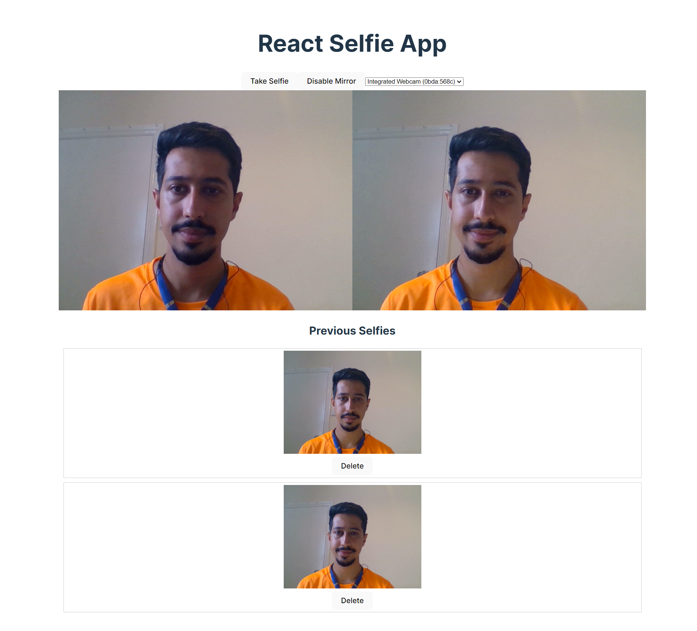

# React Selfie App 📸

Welcome to the React Selfie App, a collaborative creation from Nimble Ape. As a shared endeavor, this repository belongs to all of us, reflecting the collective spirit of exploration and innovation within our team.

**Note:** This project originated as a technical challenge during an interview process, designed to assess and showcase candidates' technical prowess, creativity, and problem-solving skills. Its purpose was to provide an opportunity for participants to demonstrate their hands-on experience and expertise in React and web development.

## Component Parts of the Task 🛠️

The React Selfie App encompasses a variety of component parts, each showcasing essential skills and techniques:

- **Using Vite:** The project is set up and managed using Vite, a build tool that offers fast development and build times. [Learn more](https://vitejs.dev/)

- **Using React & React Hooks:** The app is built using the React library, employing modern functional components and hooks to create a seamless user experience. [Explore React](https://reactjs.org/)

- **Using getUserMedia:** The `getUserMedia` API is harnessed to access the user's camera, enabling real-time video stream and image capture. [Read about getUserMedia](https://developer.mozilla.org/en-US/docs/Web/API/MediaDevices/getUserMedia)

- **Using Canvas API:** The Canvas API is utilized to manipulate images, applying the mirror effect to captured selfies. [Discover Canvas](https://developer.mozilla.org/en-US/docs/Web/API/Canvas_API)

- **Using the Permissions API:** The newer Permissions API is employed to check if permission has been given to access the camera, enhancing user privacy and security. [Permissions API](https://developer.mozilla.org/en-US/docs/Web/API/Permissions_API)

## Greetings and Introduction 👋

Greetings, future explorer of the React Selfie App! Prepare to embark on a journey where selfies spring to life, all thanks to the enchanting power of React.

## Getting Started 🌟

To begin your adventure:

1. **Clone the Repository:** Start by cloning this repository to your local machine using the following command:

```bash
git clone <repository-url>
```

2. **Install Dependencies:** Navigate to the project directory and install the necessary dependencies using the following command:

```bash
cd react-selfie-app
yarn
```

3. **Launch the App:** Launch the development server with the command:

```bash
yarn dev
```

4. **Explore the App:** Open your preferred web browser and visit `localhost:port` (the port number will be displayed in your terminal) to explore and experience the React Selfie App.

## Captivating Features 🌟

- 📸 **Capture Candid Moments:** Utilize your device's camera to snap spontaneous selfies that truly capture the moment.

- 🔄 **Mirror Magic:** Toggle the mirror effect to see yourself in a whole new light. Flip the image horizontally and embrace your mirror image.

- 💾 **Local Storage Love:** Say cheese! Store your captivating selfies locally using the power of the `localforage` library and IndexedDB, ensuring your memories are safe and sound.

- 📷 **Relive the Magic:** Revisit your previous selfies right from the app interface, and bask in the nostalgia of those picture-perfect moments.

## Preview 🖼️


## How to Shine 🌟

1. **Open the React Selfie App:** Launch the app in your web browser of choice.

2. **Camera Access Approval:** Grant the app permission to access your device's camera when prompted.

3. **Capture the Moment:** Use the "Take Selfie" button to seize the moment and snap a selfie that encapsulates your unique style.

4. **Mirror, Mirror:** Toggle the "Enable Mirror" button to instantly transform your selfie with a mesmerizing mirror effect.

5. **Picture-Perfect Preview:** Admire your masterpiece as it graces the app interface, perfectly displayed and ready to be cherished.

6. **Journey into the Past:** Scroll down to discover your previous selfies, each a treasure trove of memories. Relive those candid smiles and heartfelt expressions.

7. **Farewell, Yet Fond Memories:** When the time comes to bid adieu to a selfie, use the "Delete" button next to it to gracefully remove it from storage.
## License 📜

This project proudly embraces the MIT License. For a detailed read, consult the [LICENSE](LICENSE) file.
